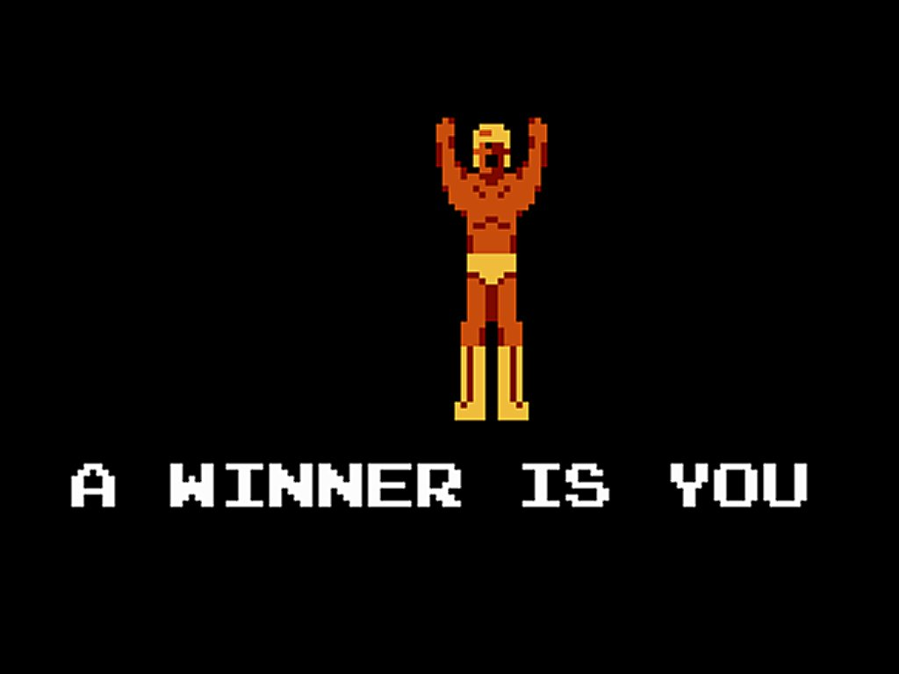

---

title: "Advent of Code 2021: Day 1"
date: 2021-12-01T23:59:00-06:00
tags:
  - advent-of-code
  - javascript
  - nodejs
social_image: ./first-star-tweet.jpeg
description: My initial thoughts after completing the first day of my first
  journey into the Advent of Code

---
I decided to try and participate in the [Advent of Code](https://adventofcode.com/) this year. This is my experience for Day 1.

If you're looking for the repo, I have setup an Advent of Code repository on GitHub [here on my profile][1].

## Simple enough, but fun!
When you read through [the first problem](https://adventofcode.com/2021/day/1) it has this little story about retrieving the keys to, what I assume is, Santa's sleigh.

To do that, you need to get a bunch of stars by solving coding problems, two per day. Once you solve the first one, you get a star and you unlock an extension of the first problem for a second star.

Get all the stars, then a winner is you!

## Initial Impressions
As advised by [Chrinkus](https://github.com/chrinkus), day 1 is a warm up day. It gets you thinking and lets you get setup.

So, I did just that and accomplished the following:

* Setup the [repository][1].
* Setup a basic project structure.
* Re-learn some JavaScript/Node fundamentals and some of the newer features (i.e. ES Module support).
* Solve the problem, like a boss.
* Attempt and fail at setting up a [dev container](https://code.visualstudio.com/docs/remote/containers-tutorial).

I did most of this over an hour or two, and it was a pretty satisfying experience overall.

## Reflections 

Looking at the day, I think I did a really good job to get myself started. Not only did I manage to complete the problem in Node v16, with ES Modules and the `fs/promises` API (which was all new to me), but I also managed to drop the dev container environment and not get hung up on silly things that don't produce code, like the project folder structure.

These are things that I can improve as I go. Normally I'd do the "backlog" thing and create issues and get myself thinking about how I can improve things..but I'm breaking that distraction and disabled issues in the repo. Any feature, problem, or whatever need to be backed wth code, and I'll do that with pull requests.

## Conclusions

Today exceeded my expectations. [Day 2](https://adventofcode.com/2021/day/2) is already up. I'm not going to look at it right now as I need to get some sleep...but I'm pretty eager to take a peek and keep earning my stars.

Thanks for playing.

[1]: https://github.com/davidwesst/advent-of-code "David Wesst's Advent of Code GitHub repository"
