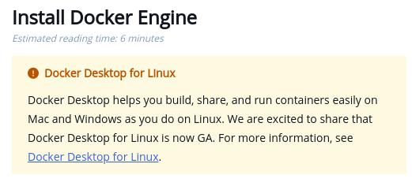

---

title: Docker Desktop for Linux is not the same as Docker Engine
date: 2022-12-13T12:00:00-05:00
tags:
  - docker
  - docker-engine
  - docker-desktop
  - linux
  - github-workflow
description: With Docker for Desktop available for Linux (which I like), I
  managed to get myself confused regarding its role on my Linux-based
  development machine. This post clarifies a few things I discovered while
  triaging an issue I had trying to test my GitHub Workflows locally.
image: ./docker-desktop-is-not-docker-engine.png
image_type: image/png
image_alt: A blue rectangular button with the words 'Download Docker Desktop'
  for Linux written on it. Above it, there is red text with an arrow pointing to
  the button that says 'This is NOT Docker Engine'.

---

[1]: https://docs.docker.com/desktop/install/linux-install/
[2]: https://docs.docker.com/engine/
[3]: https://github.com/nektos/act
[4]: https://github.com/nektos/act#necessary-prerequisites-for-running-act 
[5]: https://github.com/nektos/act/issues/1051
[6]: https://docs.docker.com/engine/context/working-with-contexts/

I like Docker Desktop. It provides me an easy-to-use GUI (graphical user interface) to manage my docker images I use for various tasks for building software. I use it on Windows, and now I'll be using it on Linux as [it is available for some of the the more common distros][1]. Regardless of its greatness, it is not the same as [Docker Engine][2] running right on the metal (rather than a virtual machine, like Docker Desktop), and some of those differences caught me while testing my GitHub Workflows with [nektos/act][3], which depends on Docker Engine to work.

To be fair, I should highlight that this is definitely a self-induced problem. The Docker Engine prerequisite is listed right on the  [README for the nektos/act][4], and had I reviewed the documentation I probably would have saved myself the trouble. Still, in my web sleuthing for solutions to the problem I created for myself, I found others had hit similar issues, hence this post.

## The Context

I discovered the problem when I attempted to test my GitHub Workflows locally using [nektos/act][3] which is a tool I have been using for the past few years in my software development. It does this by pulling down a docker image that simulates the GitHub runner and runs the workflow in that Docker container. I have done this a few times over, so went to one of my older projects where I set this up and pulled in the code to get it running.

Being that this was a fresh Linux install, I had not installed Docker yet. When I searched out the installation instructions for Docker on Linux, I was greeted with this announcement:

I have been using Docker for Desktop on Windows for a while now, and I am always happy to have software that exists across my Windows-Linux development environment ecosystem, and so I went about installing Docker for Desktop as my new Docker install.

After testing my new and shiny Docker (for Desktop) installation with the standard `docker run hello-world`, I was ready to get back to coding!

Or so I thought...

## The Problem (and Triaging it)

This is where things went sideways and the problem appeared. I ran `act -j build` to my run my `build job` in a  workflow I know has worked previously and was greeted with the following error message:

> Cannot connect to Docker daemon. Is the docker daemon running?

Not what I expected, considering I just tested out my fresh Docker install, but I tried pulling the image down myself with the `docker pull` command just to make sure things didn't break, and everything worked as expected.

With a bit of web sleuthing, I came across others who [reported the same issue][5] and noticed this link in particular:

> You could check if `/var/run` actually contains `docker.sock` 

When checking this, I found that `docker.sock` was in fact NOT present. I immediate associated it with the Docker for Desktop installation, as that was the only new variable from my previous development environment.

## The Root Cause (Probably)

This is part where I waste my time trying to figure out why did Docker for Desktop not install docker.sock. Rather that figuring out how to install the docker components that are missing.

Although I am no Docker expert, my understanding is that Docker for Desktop runs docker inside a VM rather than on the system itself, unlike Docker Engine. In fact, you can see a separate [Docker context][6] when you list out the contexts.

.

**It should be noted** that default context for Docker was listed, even though I had not installed Docker Engine yet. This lead me to believe something I installed was incorrectly configured, but really it was the fact that I had not installed the software I needed.

## The Solution / TL;DR;

As technical as I made it sound, the real problem was that I was missing software. Specifically I was missing "docker" on my Linux machine, even though I installed Docker for Desktop. 😊

Well, if the problem is that I am missing software, then the solution must be to install the software. That software is [Docker Engine][2], which sets up the Docker API right on the machine rather than though a VM like Docker for Desktop (as far as I understand it).

In conclusion, install the software dependencies the tools If you're running a Linux distro, as great as Docker for Desktop is-- you may still want to install Docker Engine. You can always switch contexts on where to run your own docker commands with the `docker context set` command, but it's worth double checking to make sure the tool you are using supports Docker for Desktop on Linux platforms.

Thanks for playing.

~ DW

