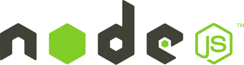

That's right. I said it: Always use Node, no matter what! Even if your server isn't going to be a Node server, just have it installed because you'll use it.

Why? That's what I'm going to tell you.

### Before we start...

I know there are plenty of other package managers for all the [different](https://www.nuget.org/) [languages](https://www.rubygems.org/) [out](https://getcomposer.org/) [there](https://pip.pypa.io/en/latest/).

I'm not saying that NodeJS is better or worse than those. **I am saying that npm is freaking fantastic for HTML developers**.

So let's start.

### Why do I need it?

When I start an HTML project there are always different tools I need. Not just script libraries, but things like compilers, or minifiers, or just something easier than Apache and IIS to run my code locally.

Back in the day, we would have a "developer setup document" that the new person would get on day one, and work their way through it over the course of the week.

Not only was the document a pain for the person to understand most of the time, but the content became out of date pretty quickly as the technology that we used changed throughout the project.

Photo credit: [jppi](http://www.morguefile.com/creative/jppi) from [morguefile.com](http://www.morguefile.com/)

### Enter Node and npm.

Instead, I can define my development dependencies with Node, and my setup document would be:

1.  Clone source code onto your local machine2.  From the command line, navigate to root directory3.  Type `npm install`4.  Build it (Post coming soon)5.  Type `npm start`6.  Project is now running.7.  Start debugging things.

That's it. The configuration is defined in the  _package.json_ file, like so:

    {
      "name": "awesome-sample-project",
      "version": "0.0.1",
      "private": true,
      "scripts": {
        "start": "node ./build/index.js"
      },
      "dependencies": {
        "nconf": "~0.6.9",
        "azure": "~0.8.1",
        "express": "^4.0.0",
      },
      "devDependencies": {
        "grunt": "^0.4.3",
        "grunt-contrib-coffee": "^0.10.1",
        "bower": "~1.3.8"
      }
    }

You can get the full scoop on package.json files [here at browsenpm.org](http://browsenpm.org/package.json).

### Making it Easier

In the beginning, writing the file yourself is necessary but as I add dependencies, I don't want to always go into the file and tinker with it. 

So, npm has a solution for that:

`npm install bower --save-dev`

For example, I always use [Bower](http://) (I'll talk about that next time). The `--save-dev` flag adds to the devDependencies section of _package.json_. I can just commit the file to source control, and now everyone that gets the source code can use the tools I want them to.

Not that they are installed, those tools are available to me. The tools work on Node, and Node works on all platforms. 

I am platform agnostic. I win. Roll credits.

### The Point

The point is simple: use a package manager. If not npm, then something that works for you and your project. Many people seem to skip Node, but as an HTML developer Node and the npm can easily keep your dev environments in sync, regardless of operating system.

Oh, I skipped over Bower on purpose. That's coming next time.

Thanks for Playing. ~ DW