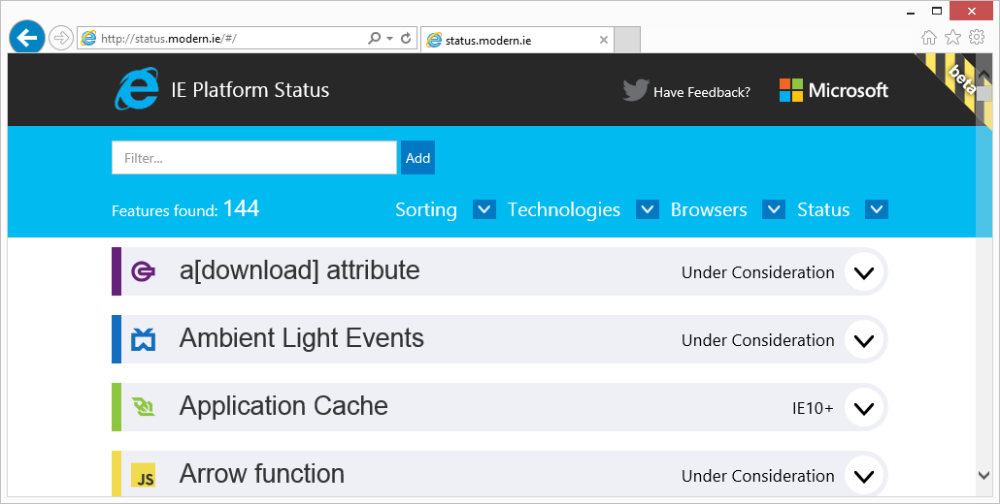
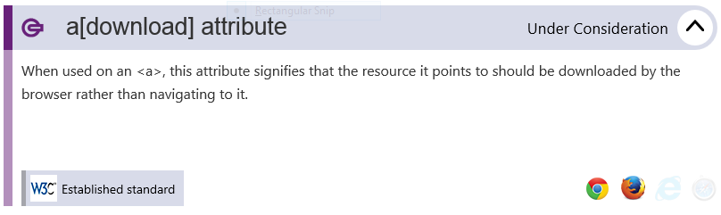

Tired of waiting to hear from Microsoft on whether or not IE will support the latest HTML5 feature?

Well wait no more with the new site direct from the Internet Explorer team: [status.modern.ie](http://status.modern.ie).

When looking up an HTML5 feature you can find...

*   ...what version of IE already supports the feature OR
*   ...the current state of the feature in the development of new versions of IE

What does the latter option mean? In the screenshot above you can see that the _download attribute_ feature for anchor tags is currently Under Consideration. That means the current versions of IE do not support it, but the IE development team is considering it for future releases.

This site is another way that the Internet Explorer group is working to be more transparent and share with the development world how they are moving forward with the vision of IE.

### But Wait, There's More!

This is more than just a IE version of [Chrome Status](http://chromestatus.com).

Not only can you see details on HTML5 features with respect to Internet Explorer, but you can see what features the competition is has implemented.

You can also see the state of the spec with the W3C, complete with a link. There is also a brief description of what the feature is, letting you browse and explore new HTML5 features that you can use in your next application.

* * *

All in all, this is a pretty useful application and a great place for developers to learn more about HTML5 features and what the IE team is doing about them.

Check it out and send feedback to [IEDevChat on Twitter](https://www.twitter.com/iedevchat).

Thanks for playing.

~ DW