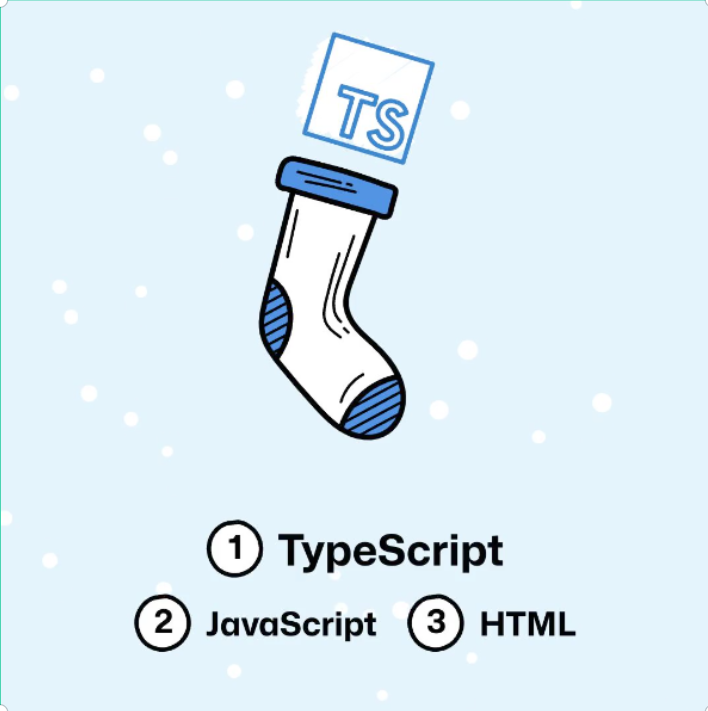

---

title: "Highlight Reel for 2022"
date: "2023-01-05T12:00:00-06:00"
description: "When a new year arrives, it is a great opportunity to take a moment to reflect on where you started at the beginning of the year, and where you ended. When I look back on 2022, I took notice of events reflected in my GitHub contribution graph that highlight some common cycles in my own personal and professional growth. I want to take a moment to document this, and hopefully you can use this an example to examine your own progress and behaviour patterns that might be aiding (or impeding) your own personal growth."
tags:
- github
- mvp
- code
- typescript
- javascript
- prdc-2022
categories:
- musings
image: "./highlight-reel-2022_thumbnail.png"
image_type: "image/png"
image_alt: "A oil painting of a movie film strip unwinding with the number 2022 in the bottom left-corner in white font with the DW logo on the center of the right side looking onto the film strip"
image_credit:
    derived_from: "https://unsplash.com/photos/9lTUAlNB87M?utm_source=unsplash&utm_medium=referral&utm_content=creditShareLink"

---

[1]: https://www.githubunwrapped.com/davidwesst
[2]: https://github.com/cocobokostudios/videogamelibrary
[3]: https://github.com/davidwesst/website/releases
[4]: https://www.davidwesst.com/tags/mvp/
[5]: https://www.davidwesst.com/blog/prairie-dev-con-2022-takeaways/
[6]: https://www.davidwesst.com/blog/open-graph-tools-and-resources-for-web-nerds/
[7]: https://www.davidwesst.com/blog/does-gdpr-apply-to-personal-websites/
[8]: https://www.davidwesst.com/talks/concensus-in-the-chaos/
[9]: http://localhost:8080/talks/cots-to-cloud/

While working on revamping my website and blog, I revisited a number of my old posts. Two of my favourites are the Highlight Reels for [2014][1] and [2015][2] as they document how I felt about myself and my accomplishments at that point in my life and career. Considering that this past year has been one of pretty extreme personal transformation, I thought it would be appropriate to document my self-reflection for 2022 in that same sort of style.

When I look back on 2022, I took notice of events or things that would trigger a particular behaviour or mindset in myself. More specifically, what I like, love, and need to improve when it comes to my own personal growth-- all of which are related to tech or code projects I worked on throughout the year on GitHub. Luckily for me, GitHub provides great insights into my contributions, and I'll be using my GitHub contributions for 2022 to highlight the spots where I can identify the behaviour. 

Why do this? Because I want to remind myself an others that if you feel like you are stuck, you are better off finding the source of the problem-- even if it makes you face some hard truths. I will explain more as we go.

## I _love to learn_ about code

At the end of 2021, I started looking at the job market and started to notice that the jobs I wanted (or thought I wanted) relied on skills that I have not been able to practice as part of my day job for the past while, as coding solutions is no longer one of my responsibilities, only planning, designing, and providing oversight. This sparked the urge to refresh my skills and prove to myself that I _could_ qualify for these jobs-- all I had to do was put in the time.

And so began a series of LeetCode challenges, learning exercises, and review of various problems so that I could skill up and strengthen those coding muscles again.

Although this spark eventually faded as it does, this time around I realized something about myself. I realized that it's not the code I love, but the learning about code and how to apply code in various ways. New languages, patterns and practices, solution architecture, whatever-- if it involves coding something, you can count I'll be interested.

### Lesson Learned: Burnout

Even though this is example highlight Q1 of 2022, there are plenty of other times where I spent time learning new tech. Experimenting with Go and Rust as part of my [VGL project][2] (more about that later). A brief experiment with Q# back in 2019 early 2020, and my continual urge to learn C/C++ along with the DevOps tools around it. These are all things I have played with over the past year or two, and each time it's the same pattern: spark of interest, dive deep into the learning, burn out because you don't know where to go with this knowledge.

That burnout isn't a bad thing, but it is definitely something I can note for future improvement.

## I _love to build things_ out of code

At the end of the year, I looked at my [GitHub Unwrapped video][1] and was surprised by my top languages for 2022.

I was trying to figure out where I had written so much TypeScript, considering that for the past few months I have been living in JavaScript and HTML. Again, going back to my contribution graph I noticed another spike in activity in May.

Although it was earlier that year, I remembered that after taking a hiatus from studying and strengthening those atrophied coding muscles, I would channel that energy into building something. Something that _I_ found useful, all while further strengthening my skills! This was the beginning of the [Video Game Library or "VGL" project][2] where I spent time building a TypeScript-Reach project and included some experiments with both Go and Rust to determine which language allowed me to leverage WASM (which was yet another rabbit hole I became excited about).

In the end I shelved the project because I was trying to accomplish too many things with it at the same time, but the excitement about building never fades, only the "something" that I am building. 

Looking back beyond 2022-- the idea of building something has always driven me. Building a business, a video game, or a product. It doesn't matter, as long as _I am building it_.

Where it falls over is when the scope gets too large and overwhelming. This is not uncommon amongst creative types (just ask any game developer) but building something out of code is something that drives me. If I can channel that excitement and passion on something I believe is worth it, I think I could produce and finish something I could be proud of.

This is why I came back to building my website that I had let fall into dormant. I wanted to channel that excitement, energy, and knowledge into something I found valuable. My website is something I talked about for years and started redoing countless times. Looking back at the contribution graph, this represents a large part of the contributions for October, November, and December for 2022. This is further evidenced by the [releases of the website][3] I published through the same time period.

### Same Drive, Different Approach

Thinking about the behaviour between May 2022 and the fourth quarter of 2022-- the drive was the same. I _loved building something_. The difference was in my approach. for the Video Game Library project, I let the excitement of learning and drive its development, which led to scope creep and dilution of the original project vision. With the website I took the time to plan and force myself to complete releases-- no matter how small.

This change in approach enabled in a longer focus on a single project. Ultimately, that kept my excitement for my website project going longer and I kept coming back to it over and over again to make small (or sometimes larger) improvements. In fact, I am continuing those improvements today as the website is far from complete-- but it's starting to represent the vision I started.

## I _like_ (not love) to share

I have tried sharing and producing content in various forms over the years, but with [Prairie Dev Con returning in 2022][5], I thought I would focus some energy into preparing and share content like I used to in my [Microsoft MVP days][4]. This meant lecture-style presentations and blogging. 

After three live events in 2022, and almost a blog post a week since mid-October, I realized that I don't love sharing like I used to...rather I only _like it_. It's a subtle difference, but it is definitely different than it once was. 

I like it because it is a _practical_ way to document my work. I love learning and building things, and sharing those things is an easy way to document my progress for others-- but more importantly myself. With the blog posts, I documented things I learned for my website like the [Open Graph protocol][6] or my [implementation of GDPR compliance][7]. For the presentations, I focused on what I knew and delivered two original sessions; one about [my day job and what it is means to be an IT Architect][8] and the other a [case study on how to do my day job][9]. 

Though this, I found that I liked the process-- but didn't love it like I used to. To me, the presentations and blog posts were necessary for other outcomes. More specifically, the presentations were my ticket to touch base with other real-life speakers and tech professionals after a multi-year hiatus. The blog posts were my way of documenting, analyzing, and appreciating my own effort into my various side projects.

Those outcomes are what drove me, not the content and excitement of creating the content and hoping to be rewarded with my MVP renewal. Personally, I think that means I've grown quite a bit since I was an MVP.

## The _need_ to improve

To close out the reflection, I want to share a couple of improvements I believe I can make. 

### I _need_ to accept my own skills and abilities

Everybody is different. I have led a very privileged career and have had massive success in many different areas. I need to take the time to appreciate that rather than compare myself to others. 

This year, just like in years past, I would get caught up in comparing myself to others and what I _couldn't_ do, rather than what I _could_ do. I would dwell on my lack of recent coding experience, rather than celebrate the time I've spent [migrating legacy systems into the cloud][9]. I would focus on the jobs I did not qualify for, rather than the ones that I did qualify for. 

This cycle of focusing on what is missing is zero-sum game. There will never be enough success if I keep that up, and the grass will always be greener on the other side of fence, no matter how many times I jump over it.

I need to remind myself of this moving forward, and hopefully you can remember that for yourself as well.

### I _need_ to do more, and talk less

People refer to me as "a talker", as in, I like to talk and I'm pretty good at it.

I leverage my talking skill in my day-to-day job, but when it comes what I am trying to build for myself I need to focus on doing the work rather than talking about it.

It might be cliché, but "talk is cheap" and I need to talk less and do more. Plain and simple.

## Conclusion / TL;DR;

In short, I figured out what I like, love, and need when it comes to my personal and professional growth. In 2022, I noticed the following about myself:

1) I _love_ to learn about code
2) I _love_ to build things out of the things I learn (in code)
3) I _like_ to share what I build and learn (for future me, and anyone else willing to listen)

The first two are my way of channelling creativity, which is why I love them so much. Although I used to _love_ sharing my knowledge, at this point in my career and life, I _like_ it as it is a practical way for me to document things as I discover them and connect with others.

In terms of how I can improve: 

4) I _need_ to accept my own skills and abilities
5) I _need_ to do more and talk less (but talk about it once it is actually done)

I _need_ to accept and embrace my current skills and abilities, rather than focusing on what I cannot bring or am unable to contribute. I also need to start implementating ideas rather that talking about them. Once I have something built, then I can talk more about it-- but until it's built, I need to focus my energy and excitement on the build rather than the talk.

Thanks for playing.

~ DW
