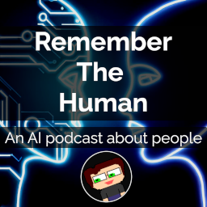

Hey friendos, it's DW.

In July 2023, I embarked on a new adventure and started a podcast titled "Remember the Human." This podcast is not your usual AI-focused talk show. Instead, it's a unique platform that brings to light the transformative impact of AI on our day-to-day lives.

## Why "Remember the Human"?

I started "Remember the Human" because I was tired of the narrative that media often puts forth about AI — the doom and gloom of what AI *could* do, rather than what it's already doing. I wanted to shift the focus from the technology itself to the human lives it's affecting. Think about it, while AI might be the star on the stage, aren't we, the humans, the audience it performs for?

"Remember the Human" is a collection of stories about the impact of AI. You'll hear from individuals whose lives have been transformed by AI, industry experts who can shed light on the practical relevance of AI, and even creators who are molding the future of AI.

The podcast is available on [YouTube][4], [Spotify][3], [Apple Podcasts][5], and [Google Podcasts][6]. Each episode is a casual conversation, just like the one we're having now. It's a space where we can talk, debate, learn, and grow together.

## Join the Conversation

I'd love for you to be a part of this journey. And the good news is, you can join the conversation in several ways. Follow the podcast on [LinkedIn][1] or join our [subreddit /r/rememberthehuman][2]. These platforms are not just for updates, but also for meaningful dialogues that can shape the direction of the podcast. 

Or, you can always find these links and anything new on the Remember the Human website at [www.rememberthehuman.ai][7].

## Conclusion \ TL;DR;

"Remember the Human" is a podcast that shifts the focus from AI technology to its impact on our lives. It's a space to hear stories about the transformative effect of AI and engage in meaningful, yet casual, conversations about its practical relevance.

The important stuff:

- I started a podcast called "Remember the Human" in July 2023.
- It focuses on the impact of AI on people's daily lives, not the technology itself.
- It is available on [YouTube][4], [Spotify][3], [Apple Podcasts][5], and [Google Podcasts][6].
- You can join the conversation on [LinkedIn][1] and [/r/rememberthehuman subreddit][2].
- Find all this infomration and more at [www.rememberthehuman.ai][7]

Thanks for playing.

[1]: https://www.linkedin.com/company/rememberthehuman/
[2]: https://www.reddit.com/r/rememberthehuman
[3]: https://open.spotify.com/show/0ylqvEi3euRtIYR0n5T4V6
[4]: https://www.youtube.com/playlist?list=PLbTA1UhK0wKike9s5uPoxqTJ8HkdY9tzn
[5]: https://podcasts.apple.com/us/podcast/remember-the-human/id1697522062
[6]: https://podcasts.google.com/feed/aHR0cHM6Ly9hbmNob3IuZm0vcy9lNWE4Nzk3MC9wb2RjYXN0L3Jzcw
[7]: http://www.rememberthehuman.ai