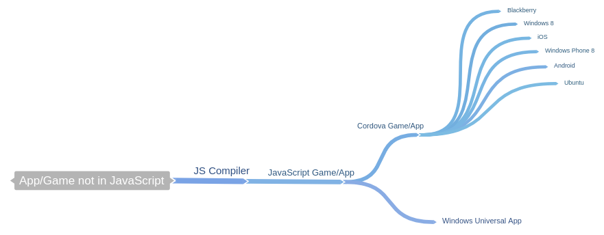

[Last week](http://www.davidwesst.com/humble-bundle-games-go-javascript/), I saw my worlds collide in this [Humble Bundle](https://www.humblebundle.com/?asmjs_bundle&amp;utm_source=Firefox&amp;utm_medium=Snippet1b&amp;utm_campaign=Humble%20Mozilla%20Bundle#asmjs_bundle-time-remaining) my mind was blown.

Let me explain.

### JS Compilation in the Real World

JavaScript and HTML5 are very present in the real world, but I hadn't seen a deep case of cross compilation.

I've seen Cordova, but that isn't the same thing. That is going JavaScript to something else, rather than the other way around. Sure, I had found examples of JS compilation, but I didn't have that awesome example that could "Wow" someone and show that compiling your `insert language here` could be compiled into JavaScript, which could then be made cross platform compatible.

Now I have eight examples thanks to Humble Bundle.

### Games Aren't Apps

[Totally agree](http://www.davidwesst.com/the-difference-between-apps-and-games/). -- It's a link to my blog post about that exact topic.

That being said, games are highly complex software that demand high performance to work. Plus, gamers (a.k.a. the users) don't care about the tech underneath the covers, they care that the game is fun. The tech just has to work, and work well, otherwise your game sucks.

In my mind, if it can work for games, it can definitely work for apps.

This is why seeing games go from C++ with asm.js to JavaScript and see the game run on the browser and the desktop is freaking awesome!

### What Business Apps Should Learn

Nothing dramatic should change other than the way you think about going cross-platform or web-based or both with your existing code base.

Take your current product or project roadmap, and start considering that you can take your code and port it to the web. It's been done for code much more complicated than your LOB code, so really consider it.

Not sure what [Cordova](http://cordova.apache.org/) is? It's an Apache project meant to take HTML5/JavaScript applications and compile the code into native apps. Basically, the next generation of [PhoneGap](http://phonegap.com/).

### It's Not _That_ Easy

Of course it isn't. I never said it was.

What I am saying is that it _can_ be done, and it has been done, which means compiling code into JavaScript isn't bleeding edge, it's becoming mainstream.

And that is why the Humble Mozilla Bundle is Awesome.

Thanks for playing. ~ DW